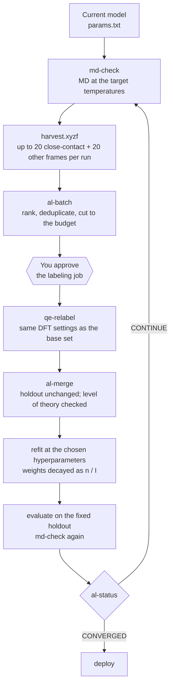
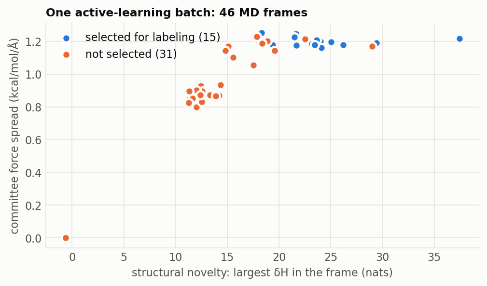

# Active learning

*A first model fitted to available data is rarely stable in molecular
dynamics: MD visits configurations, especially close contacts, that the
data never contained. Active learning lets the model find those
configurations itself, labels a few of them with DFT, and refits
**[AL20, C25]**.*

## One round

Each round lives in `03_al/round<k>/`. The hyperparameters stay fixed
between rounds; the literature's advice is to start with a basis that errs
toward complexity and prune once the data is final **[C25]**.

## Choosing what to label (`al-batch`)

Three kinds of evidence say a frame is worth a DFT calculation:

1. **Close contacts.** A pair within `close_margin` of its inner cutoff
   $r_{\mathrm{in}}$, where the penalty function takes over. These are
   what make MD unstable, and published active learning harvests them
   deliberately **[C25, HT26]**. Up to `--min-close` are taken first,
   closest first.
2. **Novelty**, independent of the model: the largest QUESTS
   $\delta\mathcal{H}$ in the frame and the fingerprint $D_j^2$
   ([data selection](data_selection.md)).
3. **Uncertainty** of the fitted model: the spread of a bootstrap
   committee.

Signals have different units, so each is converted to a normalized rank
$\rho \in [0, 1]$ over the $N$ candidates and averaged:

$$
\rho_s(i) = \frac{\operatorname{rank}_s(i) - 1}{N - 1},
\qquad
\text{score}(i) = \frac{1}{\lvert S \rvert} \sum_{s \in S} \rho_s(i),
\qquad
\text{score}(i) \ge 0.5 \ \text{for close contacts}
$$

Frames identical to training frames are dropped, near-duplicates
(consecutive MD frames) collapse to their best member, and the top
`--budget` frames become `batch.xyzf`. Every score is kept in
`batch.json`.

*Cu-Zr, one batch: 46 harvested frames, 15 selected. Novelty and
uncertainty rise together here, and the frames chosen are the most novel
ones plus the close contacts.*

### Committee uncertainty

[`committee`](../commands/committee.md) fits $M$ models to bootstrap
resamples of the training frames (frame $f$ drawn $k_f$ times gets row
weight $\sqrt{k_f}$; all members share one design matrix). For a frame
with $N_{\mathrm{at}}$ atoms, the force spread is

$$
\sigma_F = \sqrt{ \frac{1}{3 N_{\mathrm{at}}} \sum_{a=1}^{N_{\mathrm{at}}} \sum_{\gamma \in \{x,y,z\}} \operatorname{Var}_{m=1..M}\!\left[ F_{a\gamma}^{(m)} \right] }
$$

It measures how much the fit depends on which frames it saw: large where
the data does not pin the model down.

### The published selector (`al-select`, `al-run`)

al_driver's own selector **[AL20]** decomposes MD frames into
molecule-like clusters and runs a Monte Carlo search for the subset whose
histogram of ChIMES cluster energies is flattest, a Shannon-information
criterion. It converged in about eight cycles for C/O. `al-select` wraps it
for single batches and `al-run` launches al_driver's unattended loop.

## Refitting: weight decay across cycles

Early cycles produce the least physical frames (the first model is the
worst). To keep them from dominating, every row of a frame added in cycle
$I$ is weighted

$$
w_I = \frac{n}{I}
$$

with $n$ the planned number of cycles; the base set keeps the full weight
$n$ **[C25, HT26]**. `al-merge` records each frame's cycle and
`weights --frame-cycles --decay-cycles n` applies the decay on top of the
study's weighting scheme.

## When to stop (`al-status`)

`al-status` scores every round's refit on the same holdout and returns
`CONVERGED` when all of these hold, and `CONTINUE` with the failing ones
otherwise:

| criterion | evidence | source |
|---|---|---|
| MD is stable at every target temperature | `md-check` | **[C25]** |
| no frame enters an inner cutoff | `below_inner_cutoff_frames` = 0 | **[C25, HT26]** |
| MD no longer leaves the training distribution | fewer than 10 % of harvested frames novel by QUESTS, or fingerprint $D^2$ below its critical value | **[Q25, FP26]** |

It also returns `CONVERGED` when the holdout error has been flat for three
rounds while MD is stable: further labeling of the same kind is no longer
changing the model.

The labeling budget is the other stopping rule. Before the first round,
the [learning curve](data_selection.md#is-more-data-worth-it-the-learning-curve)
says whether more data of the existing kind would help at all.

## Rules that keep rounds comparable

- **One level of theory.** New labels use exactly the base set's DFT
  settings; `al-merge` refuses a mismatch.
- **The holdout never changes**, and frames identical to holdout frames
  are refused, so errors are comparable across rounds.
- **Same hyperparameters** every round; re-search only when the data has
  grown substantially.

## References

- **[AL20]** Lindsey, Fried, Goldman, Bastea, *J. Chem. Phys.* **153**, 134117 (2020). [doi:10.1063/5.0021965](https://doi.org/10.1063/5.0021965)
- **[C25]** Lindsey et al., *npj Comput. Mater.* **11**, 26 (2025). [doi:10.1038/s41524-024-01497-y](https://doi.org/10.1038/s41524-024-01497-y)
- **[HT26]** Lindsey et al., *npj Comput. Mater.* **12**, 18 (2026). [doi:10.1038/s41524-025-01863-4](https://doi.org/10.1038/s41524-025-01863-4)
- **[Q25]** Schwalbe-Koda, Hamel, Sadigh, Zhou, Lordi, *Nat. Commun.* **16** (2025). [doi:10.1038/s41467-025-59232-0](https://doi.org/10.1038/s41467-025-59232-0)
- **[FP26]** Laubach, Lordi, Lindsey, *J. Chem. Inf. Model.* **66**, 182 (2026). [doi:10.1021/acs.jcim.5c02179](https://doi.org/10.1021/acs.jcim.5c02179)

The full list, with what the toolkit takes from each paper, is on the [literature page](literature.md).
