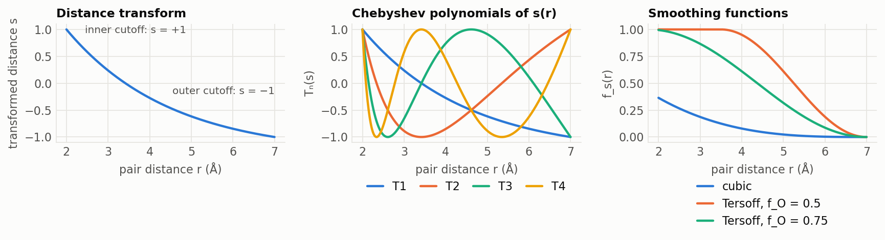
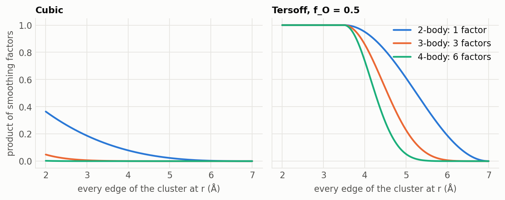

# The ChIMES model

*What the toolkit fits, in equations. Every choice the
[hyperparameter search](model_selection.md) makes is a term on this page.*

## Energy as a many-body expansion

ChIMES (Chebyshev Interaction Model for Efficient Simulation) writes the
energy of a configuration as a sum over atoms, pairs, triplets and
quadruplets **[C17, AL20]**:

$$
E = \sum_i E_i \;+\; \sum_{i<j} E_{ij} \;+\; \sum_{i<j<k} E_{ijk} \;+\; \sum_{i<j<k<l} E_{ijkl}
$$

$E_i$ is a constant per element (the energy offset fitted when energies are
in the training set). Each higher term is a polynomial in the distances
between the atoms of the cluster, and the model is **linear in its
coefficients**, which is what makes fitting a least-squares problem.

## Two-body term

$$
E_{ij} = f_p(r_{ij}) + f_s(r_{ij}) \sum_{n=1}^{\mathcal{O}_{2}} c_n^{e_i e_j}\, T_n\!\left(s_{ij}\right)
$$

- $T_n$ is the Chebyshev polynomial of the first kind of order $n$, and
  $\mathcal{O}_2$ the two-body order (`order_2b`).
- $c_n^{e_i e_j}$ are the fitted coefficients, one set per element pair.
- $s_{ij}$ is the pair distance mapped onto $[-1, 1]$, where Chebyshev
  polynomials are defined.
- $f_s$ switches the interaction off smoothly at the outer cutoff and $f_p$
  is a repulsive penalty below the inner cutoff.

### Distance transform

Distances are transformed with a Morse-like variable before they enter the
polynomials **[W19]**:

$$
x(r) = e^{-r/\lambda}, \qquad
s(r) = \frac{x(r) - \tfrac12\left[x(r_{\mathrm{in}}) + x(r_{\mathrm{out}})\right]}
            {\tfrac12\left[x(r_{\mathrm{in}}) - x(r_{\mathrm{out}})\right]}
$$

so that $s(r_{\mathrm{in}}) = +1$ and $s(r_{\mathrm{out}}) = -1$. The
transform spends the polynomial's resolution at short distances, where
the interaction changes fastest. $\lambda$ (`MORSE_LAMBDA`) is set to the
first peak of the pair's radial distribution function, and
$r_{\mathrm{in}}$ (`S_MINIM`) just below the closest contact in the
training data **[W19, C25]**; see
[cutoffs and lambdas](cutoffs_and_lambdas.md).

*Left: the transform for an illustrative metal pair ($r_{\mathrm{in}}$ = 2 Å,
$r_{\mathrm{out}}$ = 7 Å, λ = 2.5 Å). Middle: the first four basis functions
as a function of distance. Right: the two smoothing functions. Drawn by
`tools/make_doc_figures.py` from the equations on this page.*

### Smoothing and penalty

The **cubic** smoothing function **[C17]** is

$$
f_s(r) = \left(1 - \frac{r}{r_{\mathrm{out}}}\right)^{3}
$$

and the **Tersoff** form **[AL20]** leaves the interaction untouched below
a threshold $d_t = r_{\mathrm{out}}(1 - f_O)$:

$$
f_s(r) =
\begin{cases}
1, & r < d_t \\[2pt]
\tfrac12 + \tfrac12 \sin\!\left(\pi\,\dfrac{r - d_t}{r_{\mathrm{out}} - d_t} + \dfrac{\pi}{2}\right), & d_t \le r \le r_{\mathrm{out}} \\[6pt]
0, & r > r_{\mathrm{out}}
\end{cases}
$$

The penalty keeps atoms out of the region the training data never sampled
**[C17]**:

$$
f_p(r) =
\begin{cases}
A_p \left(r_{\mathrm{in}} + d_p - r\right)^{3}, & r < r_{\mathrm{in}} + d_p \\
0, & \text{otherwise}
\end{cases}
$$

Published values are $A_p = 10^{5}$ kcal mol⁻¹ Å⁻³ and $d_p$ = 0.01-0.02 Å
**[C17, C25]**. `deploy` writes these into `params.txt` explicitly
($d_p$ = 0.02 Å), and `md-check` counts the frames that enter the penalty
region.

## Three- and four-body terms

A triplet has three pair distances, and its energy is a product of one
polynomial per distance **[C17]**:

$$
E_{ijk} = f_s(r_{ij})\, f_s(r_{ik})\, f_s(r_{jk})
\sum_{m=0}^{\mathcal{O}_{3}} \sum_{p=0}^{\mathcal{O}_{3}} {\sum_{q=0}^{\mathcal{O}_{3}}}^{\prime}
c_{mpq}^{e_i e_j e_k}\; T_m(s_{ij})\, T_p(s_{ik})\, T_q(s_{jk})
$$

The primed sum keeps only terms in which at least two of $m, p, q$ are
greater than zero, so that all three atoms really enter. Coefficients are
permutationally invariant (for three identical atoms,
$c_{112} = c_{121} = c_{211}$). Four-body terms are the same construction
over the six distances of a quadruplet **[AL20]**. There is no many-body
penalty: close contacts are handled by the two-body $f_p$.

### Why the smoothing function matters for many-body terms

A cluster's energy carries **one smoothing factor per edge**: 1 for a pair,
3 for a triplet, 6 for a quadruplet. With cubic smoothing those factors
multiply to almost nothing unless every edge is short, so the fitted
columns for 3- and 4-body terms are tiny and LASSO removes them
**[AL20]**. On the Cu-Zr example the cubic 3-body columns were 10⁻³ of the
2-body scale and the 4-body columns 10⁻⁷; `TERSOFF 0.5` raised the 3-body
scale twentyfold.

*The product of smoothing factors for a cluster whose edges all have
length r. Cubic smoothing suppresses many-body terms everywhere; the
Tersoff form leaves them intact inside the threshold.*

## Fitting

Forces (and, optionally, energies and stresses) from DFT are stacked into
a vector $\mathbf{b}$. Because the model is linear, its predictions are
$\mathbf{A}\mathbf{c}$, where each column of the design matrix
$\mathbf{A}$ is the derivative of one basis function (`amat-build`). The
coefficients solve a weighted, regularized least-squares problem (`solve`):

$$
\hat{\mathbf{c}} = \arg\min_{\mathbf{c}}\;
\frac{1}{2 N_{\mathrm{rows}}} \left\lVert \mathbf{W}\left(\mathbf{A}\mathbf{c} - \mathbf{b}\right) \right\rVert_2^{2}
\;+\; \alpha \left\lVert \mathbf{c} \right\rVert_1
$$

- $\mathbf{W}$ is diagonal: one weight per force component, energy or
  stress row (`weights`). Published schemes weight forces 1, energies
  0.1-5 and stresses 100-250 **[W19, AL20, C25, HT26]**.
- The $\ell_1$ term (LASSO, solved by LARS) sets coefficients the data
  cannot support to exactly zero **[AL20]**; `deploy` removes them. $\alpha$
  is tuned by the search's `alpha` stage.
- Setting a frame's rows to weight 0 removes it from the fit without
  rebuilding $\mathbf{A}$. Cross-validation, learning curves and committees
  all use this.

## How big and how expensive

| quantity | scales as |
|---|---|
| 2-body coefficients | $N_{\text{pair types}} \times \mathcal{O}_2$ |
| 3-body coefficients | $\sim N_{\text{triplet types}} \times \mathcal{O}_3^{3}$ (fewer after symmetry) |
| 4-body coefficients | $\sim N_{\text{quadruplet types}} \times \mathcal{O}_4^{6}$ |
| clusters per atom | pairs $\propto r_{\mathrm{out}}^{3}$, triplets $\propto r_{\mathrm{out}}^{6}$, quadruplets $\propto r_{\mathrm{out}}^{9}$ |

The search's MD-cost estimate is (clusters per atom inside each body
order's cutoff) × (nonzero coefficients of that order), which is why a
statistically tied model with a shorter 3-body cutoff is preferred.

## Accuracy measures

For force components $F$ over all atoms and frames of a test set:

$$
\text{relative force error} = \frac{\mathrm{RMSE}(F)}{\sqrt{\langle F_{\mathrm{ref}}^{2} \rangle}},
\qquad
\text{reduced RMSE} = \frac{\mathrm{RMSE}(F)}{\langle \lvert F_{\mathrm{ref}} \rvert \rangle}
$$

The toolkit scores with the first; the ChIMES papers report the second
**[C17, W19, C25]**, which is larger for the same model (0.46 against 0.31
on Cu-Zr). `evaluate` reports both; compare with published values only
through `reduced_force_rmse`.

## References

- **[C17]** Lindsey, Fried, Goldman, *J. Chem. Theory Comput.* **13**, 6222 (2017). [doi:10.1021/acs.jctc.7b00867](https://doi.org/10.1021/acs.jctc.7b00867)
- **[W19]** Lindsey, Fried, Goldman, *J. Chem. Theory Comput.* **15**, 436 (2019). [doi:10.1021/acs.jctc.8b00831](https://doi.org/10.1021/acs.jctc.8b00831)
- **[AL20]** Lindsey, Fried, Goldman, Bastea, *J. Chem. Phys.* **153**, 134117 (2020). [doi:10.1063/5.0021965](https://doi.org/10.1063/5.0021965)
- **[C25]** Lindsey et al., *npj Comput. Mater.* **11**, 26 (2025). [doi:10.1038/s41524-024-01497-y](https://doi.org/10.1038/s41524-024-01497-y)
- **[HT26]** Lindsey et al., *npj Comput. Mater.* **12**, 18 (2026). [doi:10.1038/s41524-025-01863-4](https://doi.org/10.1038/s41524-025-01863-4)

The full list, with what the toolkit takes from each paper, is on the [literature page](literature.md).
