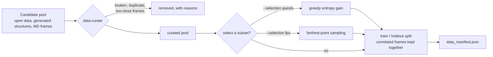
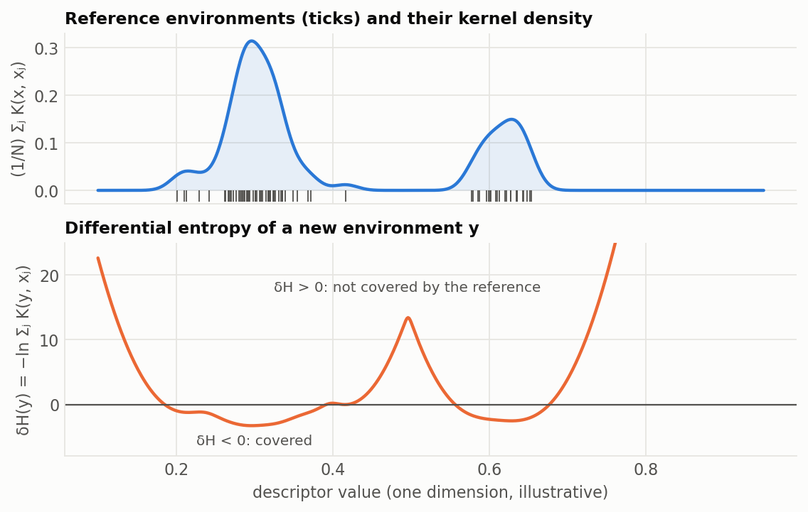
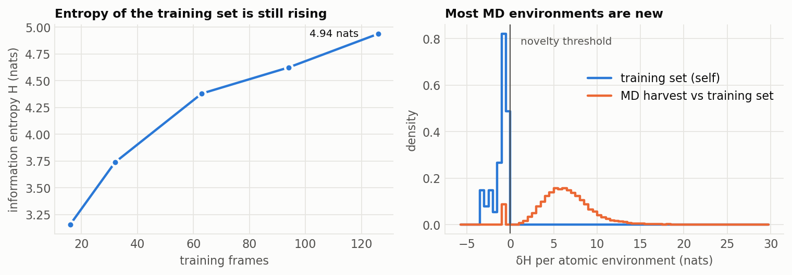
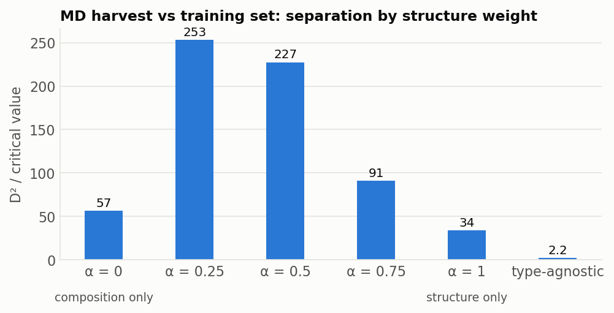
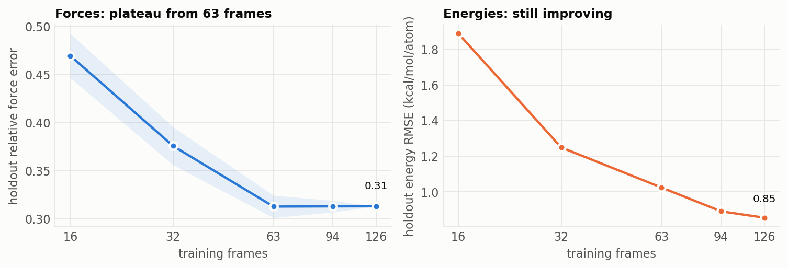

# Data selection and coverage

*Which configurations to keep, which to label next, and how to tell whether
a dataset covers what the model will meet. Three tools answer this from
different angles: information entropy of atomic environments (QUESTS),
cluster-graph fingerprints, and the learning curve.*

## Information entropy of atomic environments (QUESTS)

QUESTS **[Q25]** treats a dataset as a distribution of atom-centred
environments and measures its information content without any model.

**Descriptor.** For atom $i$, take its $k$ nearest neighbours (default
$k$ = 32 within $r_c$ = 5 Å), sorted by distance. With the smooth weight
$w(r) = \left[1 - (r/r_c)^2\right]^2$, the descriptor concatenates sorted
inverse radial distances and averaged inverse cross distances between
neighbours:

$$
X_i^{(1)} = \left\{ \frac{w(r_{ij})}{r_{ij}} \right\}_{j=1..k},
\qquad
X_i^{(2)} = \left\{ \frac{1}{k} \sum_{j} \operatorname{sort}_l\!\left[ \frac{\sqrt{w(r_{ij})\, w(r_{il})}}{r_{jl}} \right] \right\}_{l=1..k-1}
$$

Sorting makes the descriptor invariant to neighbour order; the cross
distances carry the angular information.

**Entropy.** With a Gaussian kernel of bandwidth $h$ (0.015 Å⁻¹),
$K_h(\mathbf{x}, \mathbf{y}) = \exp\!\left(-\lVert \mathbf{x} - \mathbf{y} \rVert^2 / 2h^2\right)$,
the information entropy of a set of $N$ environments is

$$
\mathcal{H}(\{\mathbf{X}\}) = -\frac{1}{N} \sum_{i=1}^{N} \ln\!\left[ \frac{1}{N} \sum_{j=1}^{N} K_h(\mathbf{X}_i, \mathbf{X}_j) \right]
$$

in nats. A dataset of $N$ identical environments has $\mathcal{H} = 0$; one
of $N$ mutually distinct environments has $\mathcal{H} = \ln N$. **When
adding frames stops raising $\mathcal{H}$, more of the same data adds no
information** (`entropy_saturated`).

**Novelty.** The differential entropy of a new environment $\mathbf{Y}$
against a reference set is

$$
\delta\mathcal{H}(\mathbf{Y} \mid \{\mathbf{X}\}) = -\ln\!\left[ \sum_{j=1}^{N} K_h(\mathbf{Y}, \mathbf{X}_j) \right]
$$

$\delta\mathcal{H} \le 0$ means the reference already holds at least one
equivalent environment; $\delta\mathcal{H} > 0$ means it does not, and the
value grows with the distance from everything in the reference **[Q25]**.

**Diversity** counts roughly how many distinct environments a set holds:
$D = \ln \sum_i \left[\sum_j K_h(\mathbf{X}_i, \mathbf{X}_j)\right]^{-1}$.

*A one-dimensional illustration computed with the formulas above (the real
descriptor has 63 dimensions). Where reference environments are dense,
δH is negative; in the gap between the two groups and beyond them it is
positive.*

### In the toolkit

- [`quests`](../commands/quests.md) reports $\mathcal{H}$, $D$, the entropy
  curve against dataset size, and $\delta\mathcal{H}$ of candidate frames.
  The default novelty threshold is the reference's own 99th-percentile
  self-$\delta\mathcal{H}$.
- `data-curate --selection quests` and `dataset-select --method quests`
  choose a subset greedily: start from each pair's closest-contact frames,
  then repeatedly add the frame whose environments have the largest mean
  $\delta\mathcal{H}$ against everything chosen so far.
- [`al-batch`](../commands/al-batch.md) uses the largest
  $\delta\mathcal{H}$ in each candidate frame as its novelty signal.

*Cu-Zr, 126 MatPES training frames (407 environments). Left: entropy is
still rising at the full set (4.94 nats), so the data is not saturated.
Right: environments from ChIMES MD of B2 CuZr (46 frames, 19,872
environments) sit far above the training set's own range: 44 of 46 frames
are novel.*

## Farthest-point sampling

`--selection fps` picks frames one at a time, each the farthest from those
already chosen in a simple descriptor space (composition, energy per atom
or both):

$$
j^{*} = \arg\max_{j \notin S}\; \min_{i \in S}\; \lVert \mathbf{d}_j - \mathbf{d}_i \rVert
$$

It spreads a subset across compositions and energies cheaply, but it does
not see local structure; prefer `quests` when it is installed.

## Cluster-graph fingerprints

The fingerprint **[FP26]** describes a configuration by how *different its
own clusters are from one another*, using the model's cutoffs and distance
transform. For body order $n$ with $m = \binom{n}{2}$ edges, each cluster
is the sorted vector of its transformed edge lengths
$\mathbf{e} = \operatorname{sort}\{ s(r_{ab}) \}$, and two clusters differ by

$$
D_{\mathrm{struct}}(\mathcal{C}_1, \mathcal{C}_2) = \left\lVert \mathbf{e}^{(1)} - \mathbf{e}^{(2)} \right\rVert_2
$$

The histogram of all pairwise dissimilarities, per body order,
concatenated, is the fingerprint $\mathbf{f}$ of the frame (100 bins per
order).

**Comparing datasets.** With mean fingerprints $\boldsymbol{\mu}$ and a
covariance $\boldsymbol{\Sigma}$ (pseudo-inverse $\boldsymbol{\Sigma}^{+}$),

$$
D^{2} = (\boldsymbol{\mu}_A - \boldsymbol{\mu}_B)^{\mathsf{T}}\, \boldsymbol{\Sigma}_{\mathrm{pooled}}^{+}\, (\boldsymbol{\mu}_A - \boldsymbol{\mu}_B),
\qquad
D_j^{2} = (\mathbf{f}_j - \boldsymbol{\mu}_A)^{\mathsf{T}}\, \boldsymbol{\Sigma}_A^{+}\, (\mathbf{f}_j - \boldsymbol{\mu}_A)
$$

$D^2$ compares two sets and $D_j^2$ tests one frame against a reference
set. Both are judged against a χ² critical value with the covariance rank
as degrees of freedom **[FP26]**. When ChIMES-MD frames are no longer
distinguishable from DFT frames at a state point, active learning has
converged there.

### Element awareness

The published fingerprint compares structure only. Its element-aware
extension (Laubach et al., submitted) mixes a compositional distance in
through one weight $\alpha \in [0, 1]$, without enlarging the descriptor:

$$
D_{\mathrm{total}} = \alpha\, \frac{D_{\mathrm{struct}}}{2\sqrt{m}} + (1 - \alpha)\, \frac{D_{\mathrm{comp}}}{t_{\max} - t_{\min}}
$$

Here $t$ is an element descriptor (the atomic mass by default). For pairs,
$D_{\mathrm{comp}}$ is the mean absolute difference of the sorted
descriptors. For triplets and quadruplets, atoms are first ordered by
centrality, $S_a = \sum_{b \neq a} e_{ab}$ (most central first), and

$$
D_{\mathrm{comp}}^{(n)} = \frac{1}{\sqrt{n}} \left\lVert \mathbf{t}_{\pi}^{(1)} - \mathbf{t}_{\pi}^{(2)} \right\rVert_2
$$

so an A-A-B triangle with B at the apex differs from one with B at a
corner. $\alpha = 1$ is structure only and $\alpha = 0$ composition only.

*Cu-Zr: how strongly the fingerprint separates the MD harvest from the
training set (D² over its critical value; above 1 means distinguishable).
A mixed metric separates far more than structure or composition alone, and
the type-agnostic fingerprint barely separates them: in an alloy, chemical
order carries much of the difference. `fingerprint --structure-weights`
produces this sweep.*

## Is more data worth it? The learning curve

[`learning-curve`](../commands/learning-curve.md) refits the chosen basis
on nested subsets (row weights, one design matrix) and scores each on the
fixed holdout. The tail is fitted to a power law,

$$
\varepsilon(N) \approx a\, N^{\,b}
$$

and the verdict is **data-limited** when $b \le -0.1$ (doubling the data
is predicted to lower the error by $1 - 2^{b}$) and **plateau** otherwise.
At a plateau, more frames of the same kind will not help; new *conditions*
(coverage) or a richer basis might.

*Cu-Zr: force error stops improving at 63 frames while energy error keeps
falling. The shaded band is the spread over two random subset draws.*

## Which tool answers which question

| question | tool | reads |
|---|---|---|
| Is the pool redundant? Has it saturated? | `quests` | entropy, entropy curve |
| Which subset should I label or keep? | `data-curate --selection quests`, `dataset-select` | greedy δH, or FPS |
| Does MD leave the training distribution? | `quests`, `fingerprint` | δH per environment; D², D_j² |
| Is the difference structural or chemical? | `fingerprint --structure-weights` | D²/critical against α |
| Would more of this data help? | `learning-curve` | power-law tail |
| Where is the fitted model itself unsure? | `committee` | spread over bootstrap fits |

## References

- **[Q25]** Schwalbe-Koda, Hamel, Sadigh, Zhou, Lordi, *Nat. Commun.* **16** (2025). [doi:10.1038/s41467-025-59232-0](https://doi.org/10.1038/s41467-025-59232-0)
- **[FP26]** Laubach, Lordi, Lindsey, *J. Chem. Inf. Model.* **66**, 182 (2026). [doi:10.1021/acs.jcim.5c02179](https://doi.org/10.1021/acs.jcim.5c02179)
- **[C25]** Lindsey et al., *npj Comput. Mater.* **11**, 26 (2025). [doi:10.1038/s41524-024-01497-y](https://doi.org/10.1038/s41524-024-01497-y)

The full list, with what the toolkit takes from each paper, is on the [literature page](literature.md).
