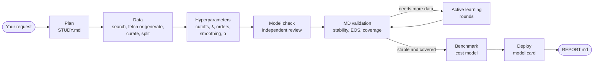
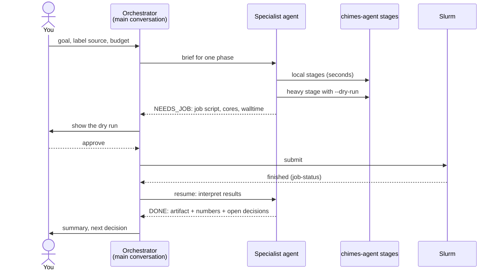
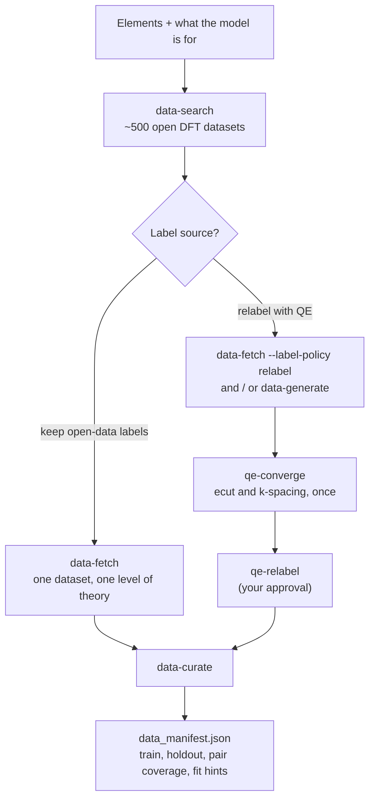
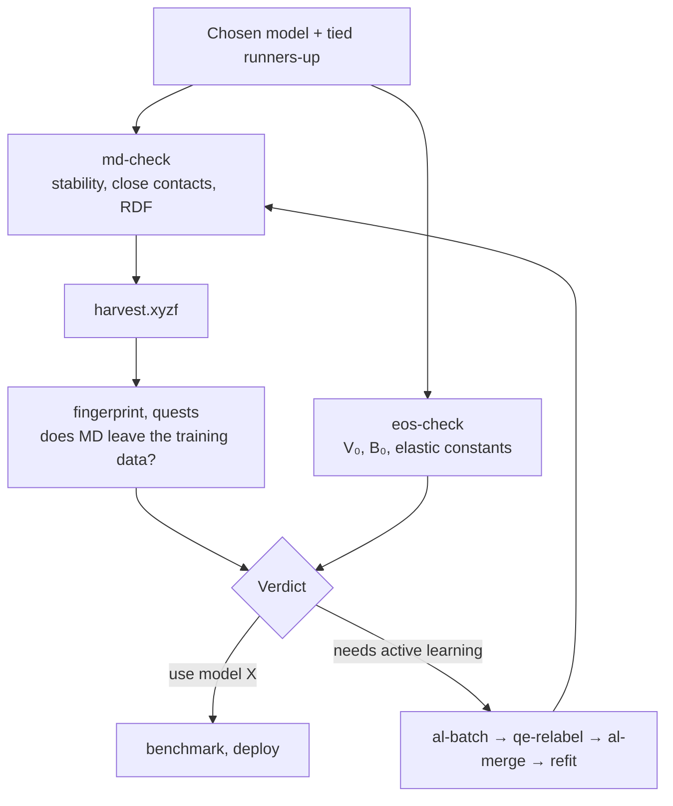

# The workflow in pictures

*How a study moves from a request to a deployed model, who does each
part, and where you are asked. The equations behind each box are on the
other Methods pages.*

## A study, end to end

Each box ends with one file the next box reads
([study layout](../guide/study_layout.md)), so a study can stop and resume
anywhere. `chimes-agent study --study DIR --status` shows where it stands.

## Who does what

Agents never submit jobs. Anything that spends allocation is shown as a
dry run first, and a hook in `.claude/` asks you again at the tool level
([the agents](../guide/agents.md), [compute and approvals](../guide/compute.md)).

## The data phase

One level of theory per fit: labels from different codes or settings have
different energy references and cannot share a fit
([the data phase](data_curation.md), [data selection](data_selection.md)).

## The hyperparameter search

```mermaid
flowchart LR
    AN["hyper-analyze<br/>inner cutoffs, λ, shells"] --> B2[2-body<br/>order × cutoff]
    B2 --> B3[3-body<br/>order × cutoff]
    B3 --> P3[per-pair<br/>3-body cutoffs]
    P3 --> B4[4-body<br/>if 3-body helped]
    B4 --> SM[smoothing<br/>cubic vs Tersoff]
    SM --> EX[exclusions<br/>drop cluster types]
    EX --> LA[λ scale,<br/>per-pair λ]
    LA --> RF[refine<br/>orders, cutoff midpoints]
    RF --> AP[α]
    AP --> ST[stress weight]
    ST --> CH[hyper_choice.json<br/>HYPER_REPORT.md]
```

Every stage scores its candidates by cross-validation or on the holdout
and keeps the cheapest (or richest) model that is statistically tied with
the best ([how a model is chosen](model_selection.md)). The terms being
chosen are defined in [the ChIMES model](chimes_model.md).

## Validation and active learning

Holdout error is necessary but not sufficient: published ChIMES models
were chosen by MD against DFT, not by holdout error alone **[W19]**. The
loop on the right is described in [active learning](active_learning.md).

## References

- **[W19]** Lindsey, Fried, Goldman, *J. Chem. Theory Comput.* **15**, 436 (2019). [doi:10.1021/acs.jctc.8b00831](https://doi.org/10.1021/acs.jctc.8b00831)

The full list is on the [literature page](literature.md).
